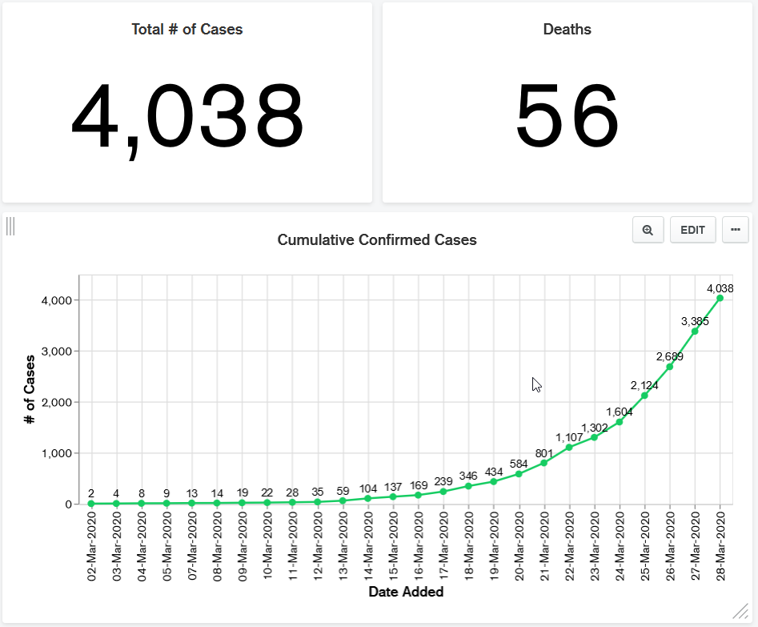

# COVID-19-FL
Pulls COVID-19 / Coronavirus case data from the Florida Department of Health and stores it to a MongoDb instance.

Check out a working dashboard [here](https://charts.mongodb.com/charts-project-0-gegka/public/dashboards/fbd7f26c-f393-4155-b8f1-6119e72ed843).

Currently publishing embedded chart data at [https://www.covid19florida.info/](https://www.covid19florida.info/)



# Installation

The following instructions are for Windows 10. 

Clone this repository:

```git clone https://github.com/mariuspopovici/COVID-19-FL.git```

Switch directory to the ```COVID-19-FL``` folder.

```
cd COVID-19-FL
```

## Prerequisites

## Virtualenv

Install **virtualenv**:
``` 
pip install virtualenv
```

Create a new virtual environment:
```
virtualenv env
```

Activate the virtual environment:
```
.\env\Scripts\activate
```

## Install Packages
```
pip install -r example-requirements.txt
```

## Set Up MongoDB

You can download and install MongoDB locally or set up a cloud instance of MongoDB Atlas. See this [video](https://www.youtube.com/watch?v=_d8CBOtadRA) for instructions.

Also view this tutorial [here](https://youtu.be/VQnmcBnguPY).

Create a new database and a collection called *florida*.
Get the cluster URL and use it to create the configuration file below.

## Configure

Edit *sampleconfig.json* and save it as *config.json* in the project folder.

```
{
  "mongodb": {
    "url": "mongodb+srv://<enter_your_mongodb_URL_here>",
    "database": "<database_name>"
  },
  "other": {
    "dashboard_url": "<analytics_dasboard_url>"
  },
  "smtp": {
    "user": "<your_email_address>",
    "password": "<your_email_password>",
    "email_from": "<from_email_address>",
    "email_to": "<to_email_address>"
  },
  "api": {
    "url": "https://services1.arcgis.com/CY1LXxl9zlJeBuRZ/ArcGIS/rest/services/Florida_COVID19_Case_Line_Data/FeatureServer/0/query"
  }
}
```

## Run

Execute the following command to pull the latest data and store new cases in our MongoDB instance.

```
python cv-api.py
```
